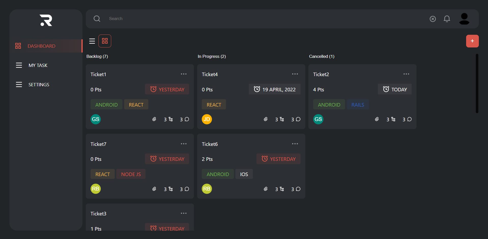

# Crud Challenge

This app consists in create, update, delete, and read tasks and users from an API

I used Vite because of the fast reload to show changes on screen, also used Typescript with React to challenge myself.

</img>

[LIVE DEMO](https://challenge-crud.vercel.app/)

## Technologies
Vite
React
Typescript
Sass
Eslint
React-router-dom
Axios
Redux
Redux-Thunk
Material-UI

## Installation

Use npm or yarn
```bash
npm install
or
yarn install
```

## Usage

Add an .env file in the root of the proyect and add and fill with the correct data.

```javascript
VITE_API_URL_BASE = https://..............url
VITE_API_TOKEN = token.............string

```
After that, you can run in the terminal:

```javascript
npm run dev
```

## Contributing
Pull requests are welcome. For major changes, please open an issue first to discuss what you would like to change.

Please make sure to update tests as appropriate.

## License
[MIT](https://choosealicense.com/licenses/mit/)
